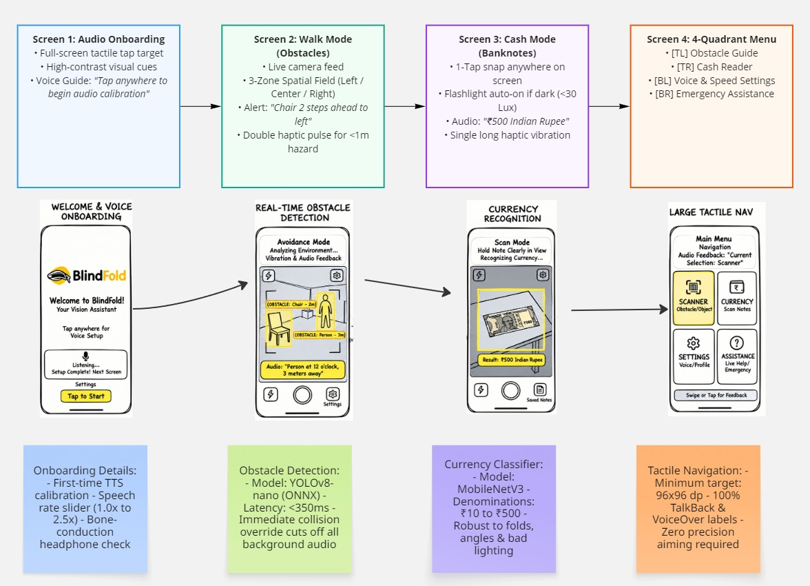

# BlindFold (VisionMate) 👁️🎙️

An audio-first vision assistant for visually impaired people. It uses lightweight on-device / edge CNNs to give instant voice alerts for obstacles and identify paper currency notes in real time.

Built to run with sub-400ms latency, zero sight required, and zero reliance on sighted volunteers or slow cloud LLMs.

---

## Why we're building this

White canes are great for ground-level detection within 1 meter, but they completely miss:
- Head and chest-level hazards (open cabinet doors, tree branches, pipes, signs).
- Moving obstacles ahead before you bump into them.
- Paper currency denominations — tactile markings on Indian Rupee notes wear off within a couple of months, making cash transactions stressful.

Existing apps either connect you to a live volunteer (long wait times, privacy issues with personal documents/money) or send frames to cloud vision LLMs that take 2-4 seconds to reply — far too slow when you're walking.

BlindFold fixes this by running fast, lightweight vision models (YOLOv8-nano + MobileNetV3) designed to speak warnings into your ear before you take your next step.

---

## Project Documentation

Here's the project spec and design breakdown:

- [**PRD.md**](./PRD.md) — Problem breakdown, target persona (college student), MVP scope, and test metrics.
- [**ARCHITECTURE.md**](./ARCHITECTURE.md) — System flow, component diagram, tech choices, and DB schema.
- [**API_SPEC.md**](./API_SPEC.md) — Backend endpoints, auth flow, and TTS-friendly error payloads.
- [**REQUIREMENTS.md**](./REQUIREMENTS.md) — Functional specs (FR-01 to FR-15), performance targets, and constraints.
- [**ROADMAP.md**](./ROADMAP.md) — 8-week breakdown across Kenshi (MVP), Samurai, and Shogun milestones.

---

## Wireframe & Screen Flow

The UI is built around a **4-quadrant tactile layout** — no aiming at tiny buttons. You can tap anywhere in a quadrant or use simple swipes.

- **Quadrant 1 (Top-Left):** Obstacle Guide (Continuous camera scan + spatial audio)
- **Quadrant 2 (Top-Right):** Cash Identifier (Single-tap snap + spoken denomination)
- **Quadrant 3 (Bottom-Left):** Voice Settings (Speech speed slider, haptic toggles)
- **Quadrant 4 (Bottom-Right):** Help & Emergency Contact

Wireframe asset: [`docs/sketch.png`](./docs/sketch.png)  
Live Miro Board: [Open BlindFold Wireframe & User Flow on Miro](https://miro.com/app/board/uXjVHjznca4=)

---

## Tech Stack

- **Mobile:** Flutter (Dart) — native TalkBack & VoiceOver support, fast camera stream access.
- **Backend:** FastAPI (Python 3.11) — async routing, handles vision requests and user profiles.
- **Vision Models:**
  - Obstacles: YOLOv8-nano (ONNX / TFLite) for low-latency bounding boxes.
  - Currency: MobileNetV3 trained on INR notes (₹10 to ₹500).
- **Auth & Storage:** Supabase (PostgreSQL + passwordless / biometric login).
- **Audio Output:** Device-native TTS engine + spatial audio panning and haptics.

---

## Next Up (Sprint 1)
- [ ] Export YOLOv8-nano and MobileNetV3 to ONNX / TFLite.
- [ ] Scaffold Flutter app with 4-quadrant tactile interface & TalkBack semantics.
- [ ] Wire up camera frame capture to FastAPI endpoint.
